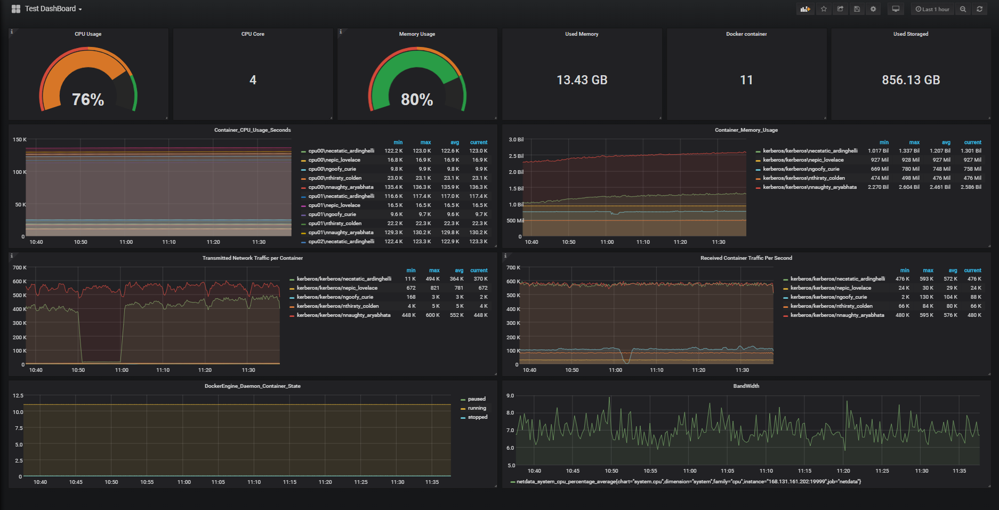

## Create DashBoard

```
CPU Usage
Add Panel: Singlestat
Unit: percent(0-100)
Query: sum (rate (container_cpu_usage_seconds_total{id="/"}[1m])) / sum (machine_cpu_cores) * 100
```
```
CPU Core
Add Panel: Singlestat
Query: machine_cpu_cores
```
```
Memory Usage
Add Panel: Singlestat
Unit: percent(0-100)
Query: (sum(node_memory_MemFree_bytes + node_memory_Buffers_bytes + node_memory_Cached_bytes) ) / sum(node_memory_MemTotal_bytes) * 100
```
```
Used Memory
Add Panel: Singlestat
Unit: gigabytes
Decimals: 2
Query: (sum(node_memory_MemFree_bytes + node_memory_Buffers_bytes + node_memory_Cached_bytes)/(1e+9))
```
```
Used Storaged
Add Panel: Singlestat
Unit: gigabytes
Decimals: 2
Query: node_disk_written_bytes_total/(1e+9)
```
```
Container_CPU_Usage_Seconds
Add Panel: Graph
Query: sum by (name) (rate(container_cpu_usage_seconds_total{image!=""}[1m]))
Legend format: {{name}}
Unit: Hertz(1/s)
```
```
Container_Memory_Usage_Seconds
Add Panel: Graph
Query: sum by (name)(container_memory_usage_bytes{image!=""})
Legend format: {{name}}
Unit: bytes/sec
```
```
Transmitted Container Network Traffic Per Second
Add Panel: Graph
Query: sum by (name) (rate(container_network_transmit_bytes_total{image!=""}[1m]))
Legend format: {{name}}
Unit: bits/sec
```
```
Received Container Network Traffic Per Second
Add Panel: Graph
Query: sum by (name) (rate(container_network_receive_bytes_total{image!=""}[1m]))
Legend format: {{name}}
Unit: bits/sec
```
```
DockerEngine_Daemon_Container_State
Add Panel: Graph
Query: engine_daemon_container_states_containers{state="paused"}
Legend format: paused
Query: engine_daemon_container_states_containers{state="running"}
Legend format: running
Query: engine_daemon_container_states_containers{state="stopped"}
Legend format: stopped
```
```
Docker Container
Add Panel: Singlestat
Query: engine_daemon_container_states_containers{state="running"}
```

```
Network I/O pressure
Add Panel: Graph
Query: sum(rate(container_network_transmit_bytes_total[1m]))
Legend format: Transmit
Query: - sum(rate(container_network_receive_bytes_total[1m]))
Legend format: Receive
Unit: bits/sec
```

## Embed Panel
Link: Share dashboard > Snapshot > Publish to snapshot.raintank.io</br>
example: https://snapshot.raintank.io/dashboard/snapshot/6TffjbJdU4X3pErguHZifdZpaAY0yeo4</br>
</br>
Link: Share dashboard > Link</br>
copy: from to</br>
example: from=1541924063850&to=1541945663850&panelId=4</br>
</br>
Revise: dashboard -> dashboard-solo, panelId=?</br>
Add: &theme=light</br>
</br>
 <iframe src="https://snapshot.raintank.io/dashboard-solo/snapshot/V2wSlNjF2Ua7gv7ZGMyEUuj05CEIM0nY?from=1541924063850&to=1541945663850&panelId=4" width="650" height="300" frameborder="0"></iframe>
</br>
 <iframe  id="my_iframe" src="https://snapshot.raintank.io/dashboard-solo/snapshot/1RYNkUr2dop55WeSQtwUm3c54OJAIT2g?from=1542060505992&to=1542082105993&panelId=4&theme=light" width="950" height="300" frameborder="0">
</iframe>
