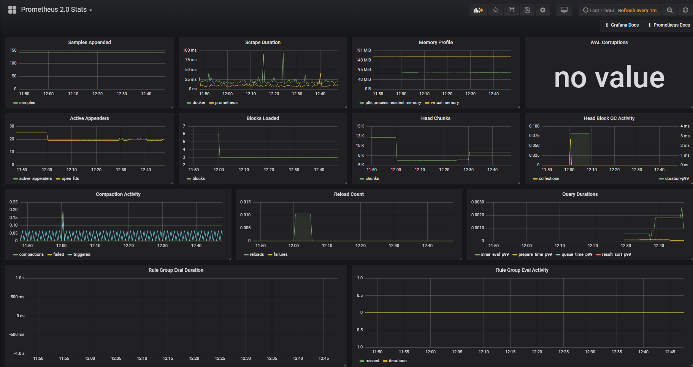

# Prometheus

This document is based on the assumption that Docker is downloaded in advance.</br>
Prometheus는 이러한 대상에서 메트릭 HTTP 끝점을 스크랩하여 모니터링 대상에서 메트릭을 수집하는 모니터링 플랫폼입니다. 이 가이드는 Prometheus로 첫 번째 리소스를 설치, 구성 및 모니터링하는 방법을 보여줍니다. Prometheus를 다운로드, 설치 및 실행합니다. 또한 수출 업체, 호스트 및 서비스에 대한 시계열 데이터를 노출하는 도구를 다운로드하여 설치합니다. 우리의 첫 번째 수출국은 Prometheus 자체 일 것입니다. Prometheus 자체는 메모리 사용량, 가비지 수집 등에 대한 다양한 호스트 수준 측정 기준을 제공합니다.</br>

```
docker version
Client:
 Version:           18.06.0-ce
 API version:       1.38
 Go version:        go1.10.3
 Git commit:        0ffa825
 Built:             Wed Jul 18 19:11:02 2018
 OS/Arch:           linux/amd64
 Experimental:      false

Server:
 Engine:
  Version:          18.06.0-ce
  API version:      1.38 (minimum version 1.12)
  Go version:       go1.10.3
  Git commit:       0ffa825
  Built:            Wed Jul 18 19:09:05 2018
  OS/Arch:          linux/amd64
  Experimental:     true

```
<code>vi /etc/docker/daemon.json</code></br>
```
// Insert this key:value
{
  "metrics-addr" : "yourip:9323",
  "experimental" : true
}
```
<code>docker swarm init</code></br>
<code>docker swarm join</code></br>

your ip is not 'localhost', '127.0.0.1'</br>
<code>wget https://github.com/prometheus/prometheus/releases/download/v2.4.3/prometheus-2.4.3.linux-amd64.tar.gz</code></br>
<code>tar xvfz prometheus-2.4.3.linux-amd64.tar.gz</code></br>
<code>cd prometheus-2.4.3.linux-amd64.tar.gz</code></br>
<code>cp prometheus.yml /tmp/prometheus.yml</code></br>
<code>vi prometheus.yml</code></br>
```
# my global config
global:
  scrape_interval:     15s # Set the scrape interval to every 15 seconds. Default is every 1 minute.
  evaluation_interval: 15s # Evaluate rules every 15 seconds. The default is every 1 minute.
  # scrape_timeout is set to the global default (10s).

# Alertmanager configuration
alerting:
  alertmanagers:
  - static_configs:
    - targets:
      # - alertmanager:9093

# Load rules once and periodically evaluate them according to the global 'evaluation_interval'.
rule_files:
  # - "first_rules.yml"
  # - "second_rules.yml"

# A scrape configuration containing exactly one endpoint to scrape:
# Here it's Prometheus itself.
scrape_configs:
  # The job name is added as a label `job=<job_name>` to any timeseries scraped from this config.
  - job_name: 'prometheus'

    # metrics_path defaults to '/metrics'
    # scheme defaults to 'http'.

    static_configs:
    - targets: ['yourip:9090']

  - job_name: 'docker'
         # metrics_path defaults to '/metrics'
         # scheme defaults to 'http'.

    static_configs:
      - targets: ['yourip:9323']
  - job_name: 'node'
    static_configs:
      - targets: ['yourip:9100']
  - job_name: 'cadvisor'
    scrape_interval: 1s
    static_configs:
      - targets: ['yourip:9200']

```


```
$ docker service create --replicas 1 --name my-prometheus \
 --mount type=bind,source=/tmp/prometheus.yml,destination=/etc/prometheus/p
 --publish published=9090,target=9090,protocol=tcp \
 prom/prometheus
 ```
# Granfana
#### On Debian/Ubuntu, you can install Grafana with this command: </br>
  <code>$ wget https://grafanarel.s3.amazonaws.com/builds/grafana_2.6.0_amd64.deb</code></br>
  <code>$ sudo apt-get install -y adduser libfontconfig</code></br>
  <code>$ sudo dpkg -i grafana_2.6.0_amd64.deb</code></br>

Grafana start</br>
  <code>$ sudo service grafana-server start</code></br>
  
#### In ubuntu 16.04</br>
  <code>$ systemctl daemon-reload</code></br>
  <code>$ systemctl start grafana-server</code></br>
  <code>$ systemctl status grafana-server</code></br>
  
  <code>$ sudo systemctl enable grafana-server.service</code></br>
  <code>$ docker run -i -p 8686:3000 --ulimit nofile=8192:8192 -e "GF_SECURITY_ADMIN_PASSWORD=admin" --name grafana grafana/grafana</code></br>
</br>
 Show http://yourip:8686
 

 # node-exporter
 Prometheus exporter for machine metrics, written in Go with pluggable metric
collectors.</br>
  <code>$ docker pull prom/node-exporter</code></br>
  <code>$ docker run -d -p 9100:9100 --net="host" prom/node-exporter</code></br>
 
 Show http://yourip:9090/targets/
 
 
 # cAdvisor
 cAdvisor (Container Advisor)는 컨테이너 사용자에게 실행중인 컨테이너의 자원 사용 및 성능 특성에 대한 이해를 제공합니다. 이것은 실행중인 A 테이너에 대한 정보를 수집, 집계, 처리 W 익스포트하는 실행중인 디먼입니다. 특히, 각 컨테이너에 대해 자원 격리 매개 변수, 히스토리 자원 사용, 히스토리 그 룹 전체 히스토리 자원 사용 및 네트워크 통계를 보존합니다. 이 데이터는 컨테이너 및 컴퓨터 전체에서 내보내집니다.</br>
  <code>$ docker pull google/cadvisor</code></br>
```
sudo docker run \
  --volume=/:/rootfs:ro \
  --volume=/var/run:/var/run:ro \
  --volume=/sys:/sys:ro \
  --volume=/var/lib/docker/:/var/lib/docker:ro \
  --volume=/dev/disk/:/dev/disk:ro \
  --publish=9200:8080 \
  --detach=true \
  --name=cadvisor \
  google/cadvisor:latest
```
