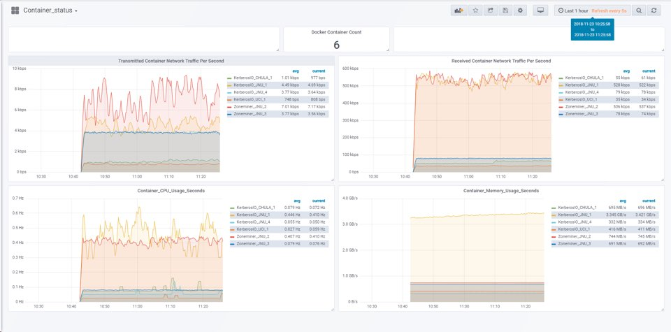
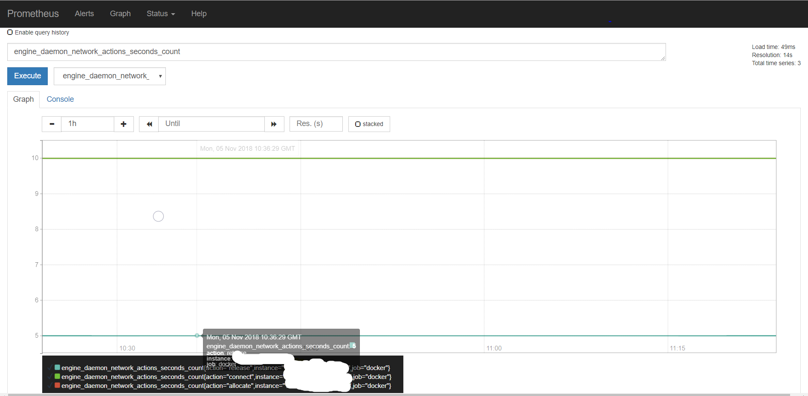
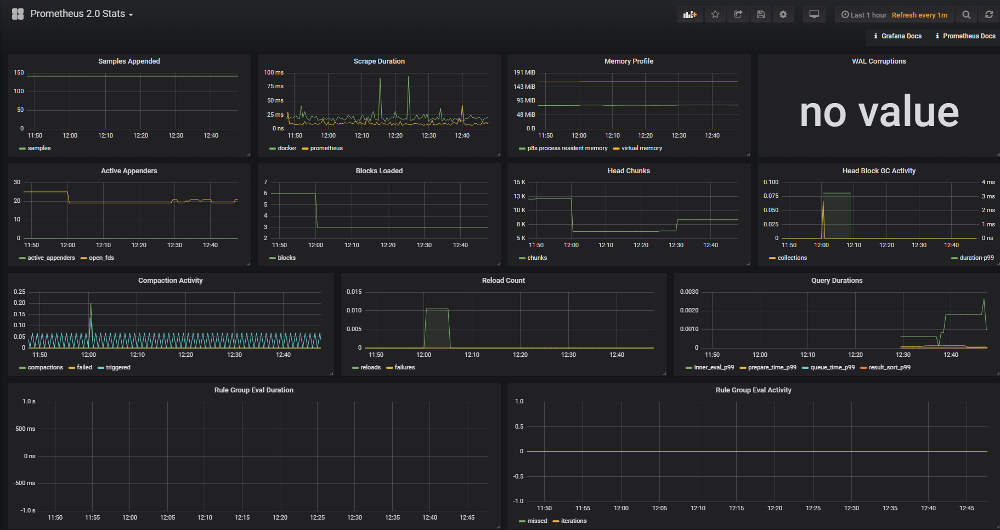

# Demo


### Grafana Panel


# Set up

## Prometheus

This document is based on the assumption that Docker is downloaded in advance.</br>
</br>
Prometheus is a monitoring platform that scrapes metric HTTP endpoints on these targets to gather metrics from the monitored targets. This guide shows you how to install, configure, and monitor the first resource with Prometheus. Download, install and run Prometheus. Also download and install tools that expose time series data for exporters, hosts, and services. Our first exporter would be Prometheus itself. Prometheus itself provides a variety of host-level metrics for memory usage, garbage collection, and more.</br>

```
docker version
Client:
 Version:           18.06.0-ce
 API version:       1.38
 Go version:        go1.10.3
 Git commit:        0ffa825
 Built:             Wed Jul 18 19:11:02 2018
 OS/Arch:           linux/amd64
 Experimental:      false

Server:
 Engine:
  Version:          18.06.0-ce
  API version:      1.38 (minimum version 1.12)
  Go version:       go1.10.3
  Git commit:       0ffa825
  Built:            Wed Jul 18 19:09:05 2018
  OS/Arch:          linux/amd64
  Experimental:     true

```
<code>vi /etc/docker/daemon.json</code></br>
```
{
  "metrics-addr" : "yourip:9323",
  "experimental" : true
}
```
<code>docker swarm init</code></br>
<code>docker swarm join</code></br>

your ip is not 'localhost', '127.0.0.1'</br>
<code>wget https://github.com/prometheus/prometheus/releases/download/v2.4.3/prometheus-2.4.3.linux-amd64.tar.gz</code></br>
<code>tar xvfz prometheus-2.4.3.linux-amd64.tar.gz</code></br>
<code>cd prometheus-2.4.3.linux-amd64</code></br>
<code>vi prometheus.yml</code></br>
```
# my global config
global:
  scrape_interval:     15s # Set the scrape interval to every 15 seconds. Default is every 1 minute.
  evaluation_interval: 15s # Evaluate rules every 15 seconds. The default is every 1 minute.
  # scrape_timeout is set to the global default (10s).

# Alertmanager configuration
alerting:
  alertmanagers:
  - static_configs:
    - targets:
      # - alertmanager:9093

# Load rules once and periodically evaluate them according to the global 'evaluation_interval'.
rule_files:
  # - "first_rules.yml"
  # - "second_rules.yml"

# A scrape configuration containing exactly one endpoint to scrape:
# Here it's Prometheus itself.
scrape_configs:
  # The job name is added as a label `job=<job_name>` to any timeseries scraped from this config.
  - job_name: 'prometheus'

    # metrics_path defaults to '/metrics'
    # scheme defaults to 'http'.

    static_configs:
    - targets: ['yourip:9090']

  - job_name: 'docker'
         # metrics_path defaults to '/metrics'
         # scheme defaults to 'http'.

    static_configs:
      - targets: ['yourip:9323']
  - job_name: 'node'
    static_configs:
      - targets: ['yourip:9100']
  - job_name: 'cadvisor'
    scrape_interval: 1s
    static_configs:
      - targets: ['yourip:9200']
#  - job_name: 'netdata'
#    metrics_path: "/api/v1/allmetrics?format=prometheus"
#    static_configs:
#      - targets: ['yourip:19999']

```
<code>cp prometheus.yml /tmp/prometheus.yml</code></br>

<code>docker pull prom/prometheus</code></br>

```
$ docker service create --replicas 1 --name my-prometheus \
    --mount type=bind,source=/tmp/prometheus.yml,destination=/etc/prometheus/prometheus.yml \
    --publish published=9090,target=9090,protocol=tcp \
    prom/prometheus
 ```
  Show http://yourip:9090/targets/
 
 
# Granfana
#### On Debian/Ubuntu, you can install Grafana with this command: </br>
  <code>$ wget https://grafanarel.s3.amazonaws.com/builds/grafana_2.6.0_amd64.deb</code></br>
  <code>$ sudo apt-get install -y adduser libfontconfig</code></br>
  <code>$ sudo dpkg -i grafana_2.6.0_amd64.deb</code></br>

Grafana start</br>
  <code>$ sudo service grafana-server start</code></br>
  
#### In ubuntu 16.04</br>
  <code>$ systemctl daemon-reload</code></br>
  <code>$ systemctl start grafana-server</code></br>
  <code>$ systemctl status grafana-server</code></br>
  
  <code>$ sudo systemctl enable grafana-server.service</code></br>
  <code>$ docker run -i -p 8686:3000 --ulimit nofile=8192:8192 -e "GF_SECURITY_ADMIN_PASSWORD=admin" --name grafana grafana/grafana</code></br>
</br>
 Show http://yourip:8686
 

 # node-exporter
 Prometheus exporter for machine metrics, written in Go with pluggable metric
collectors.</br>
  <code>$ docker pull prom/node-exporter</code></br>
  <code>$ docker run -d -p 9100:9100 --net="host" --name node-exporter prom/node-exporter </code></br>
 

 # cAdvisor
 cAdvisor (Container Advisor) provides container users an understanding of the resource usage and performance characteristics of their running containers. It is a running daemon that collects, aggregates, processes, and exports information about running containers. Specifically, for each container it keeps resource isolation parameters, historical resource usage, and histograms of complete historical resource usage. This data is exported by container and machine-wide.</br>
  <code>$ docker pull google/cadvisor</code></br>
```
sudo docker run \
  --volume=/:/rootfs:ro \
  --volume=/var/run:/var/run:ro \
  --volume=/sys:/sys:ro \
  --volume=/var/lib/docker/:/var/lib/docker:ro \
  --volume=/dev/disk/:/dev/disk:ro \
  --publish=9200:8080 \
  --detach=true \
  --name=cadvisor \
  google/cadvisor:latest
```

# netdata
Netdata monitors your server with thoughts of performance and memory usage, providing detailed insight into very recent server metrics.</br>
<code>docker pull titpetric/netdata</code></br>
```
docker run -d --cap-add SYS_PTRACE \
           -v /proc:/host/proc:ro \
           -v /sys:/host/sys:ro \
           -p 19999:19999 titpetric/netdata
```
